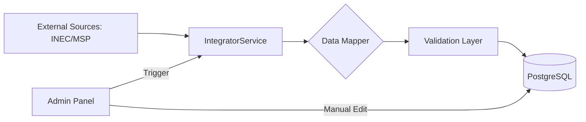

# Design Spec: Admin Panel & Data Integrator (RBE)

**Date**: 2026-03-28
**Topic**: Admin Panel, External Data Sync (INEC/MSP), and Manual Data Entry.

## 1. Goal
Provide a centralized administration interface to manage Equadorian epidemiological risks, population data, and biological species. The system must support both manual entry and automated synchronization from external sources (INEC API, MSP Open Data).

## 2. Architecture & Data Flow

### 2.1. External Sync Pipeline

### 2.2. Functional Components
- **IntegratorService (Backend)**: Orchestrates fetching (JSON/CSV), mapping fields to the `Province` and `RiskRecord` models, and handling errors.
- **Admin API (Backend)**: Protected endpoints for CRUD operations and sync triggers.
- **Admin Dashboard (Frontend)**: Real-time monitoring of sync status and forms for data entry.

## 3. Data Models (Additions)
- **Update Metadata**: Track `source_type` (manual/sync), `last_sync_at`, and `sync_status` (success/failed).
- **Audit Logs**: Store history of changes to critical epidemiological data.

## 4. UI/UX Design
- **Admin Route**: `/admin` (Basic Auth / JWT).
- **Sync Dashboard**: Status cards for each provider.
- **Entity Managers**: Table-based views for Provinces, Risks, and Species with "Add" and "Edit" modals.

## 5. Security & Validation
- **Authentication**: Requirements for basic dashboard access.
- **Integrity**: Checksums or size validation for external CSV downloads.

## 6. Testing Plan
- **Unit Tests**: Test the CSV/JSON parsers with mock files.
- **Integration Tests**: Verify that manual edits are reflected in the main map view.
- **E2E Tests**: Trigger a sync and verify data persistence.
